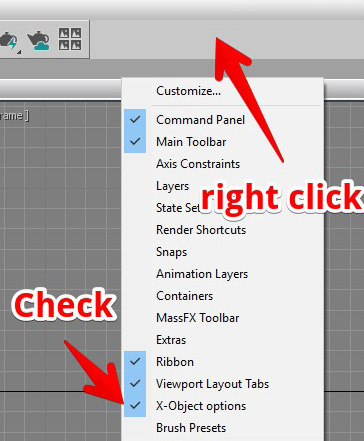
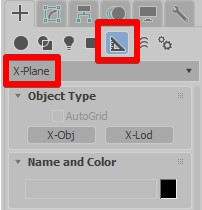
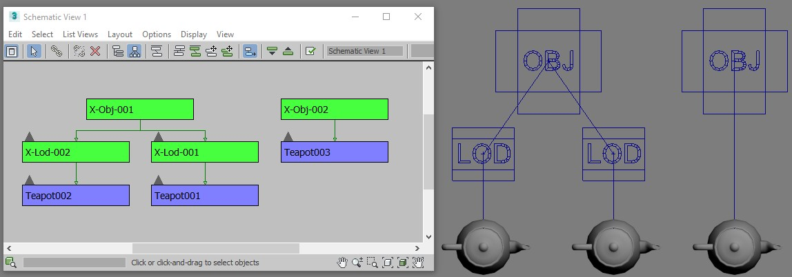
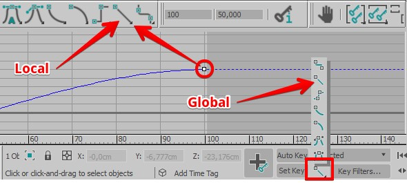

Start
========

UI
-------------------------
You have to open the window with objects options for the X-Plane.

This window can be docked to the left and the right sides or can be float.
The ``X-Obj`` and ``X-Lod`` you can find in the ``helpers`` category.

Scene Conception
-------------------------
| There is the object ``X-Obj`` in the 3Ds Max which is associated with one X-Plane obj file. One 3Ds Max scene may contain any number of that objects. 

.. note::
    If the scene contains more than one that object and more than one are marked for exporting the exporter will work as a batch exporter, and name of each X-Plane .obj file will be the same as X-Obj name. 

| The objects which needs to be exported must be linked to one ``X-Obj``. If you want to use ``X-Lod`` you need to link ``X-Lod`` to ``X-Obj`` then link your objects to that ``X-Lod``.

| The plug-in processes each object and then its children, so with the objects tree you can manage the order as well. 
| For example: Assume that you want 2 manipulators to be always processed after the display. In the .obj file it should look like this:

.. code-block:: text

    TRIS X X ## display
    TRIS X X ## manipulator 1
    TRIS X X ## manipulator 2

So you have to make manipulator 1 and manipulator 2 as children of the display.
Ordering is useful when you want to optimize your .obj.

Animation
-------------------------
You can use part of the native 3Ds max mechanism for the animation translation and rotation. For the hide/show animations the plug-in provides its own instruments.
| The plug-in supports Position XYZ and Euler XYZ controllers with the linear tangents on keys.
| You can specify the correct animation keys’ tangents globally or for the local keys only. 

.. warning::
    For animation rotate you must use only one axis for one object. 
    3Ds Max uses Euler XYZ rotation controller with the default order XYZ, so only rotation around X can be animated safely.
        
| It is possible to have other axis animated (not at the same time) but you will need to set the orientation with a parent. The system coordinates of your object must be aligned to the parent's system coordinates then you may rotate parent as you wish and animate any axis of your object. It is not the exporter problem in some use cases you will have the animation problem in 3Ds max too because of Euler XYZ. 
| If you want to have the animation rotation for more than one axis you have to do it with the additional parent objects where each the parent object has animation on certain axis. The parent objects can be any objects including helpers.
| You also can use bones for animation they always have X axis along their body.
